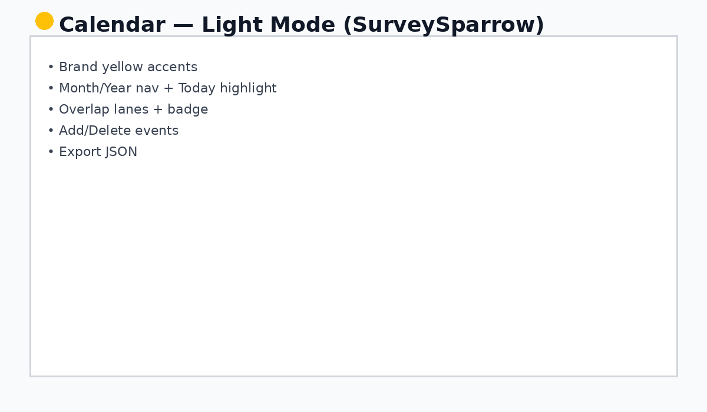
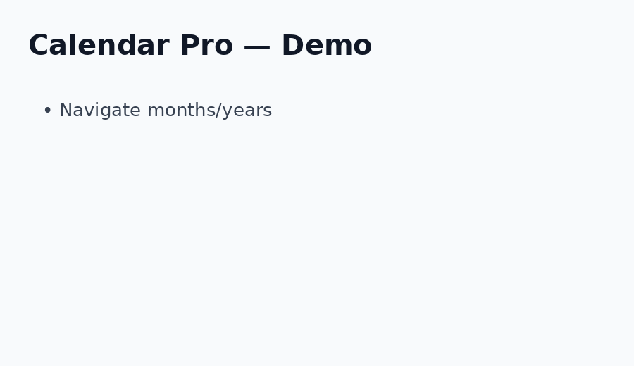

# SurveySparrow — Calendar Pro (React + Vite + Tailwind)

[](https://react.dev/)
[](https://vitejs.dev/)
[](https://tailwindcss.com/)
[](#)

**Calendar Pro** is a polished month-view calendar built for a SurveySparrow-style assignment. It includes brand accents, light/dark mode, event overlaps, and an export feature — everything needed to stand out in an interview.

<p align="center">
  
</p>

<p align="center">
  
</p>

<p align="center">
  
</p>

## ✨ Features
- 🌓 **Light/Dark mode** toggle (SurveySparrow themed)
- 📅 Month & Year navigation **+ Today** highlight
- 🧭 Smooth grid with **overlap lanes** & badge
- ➕ Add / ➖ Delete events in the right panel
- 💾 **localStorage** persistence
- 📤 **Export Events to JSON** (one click)
- ♿ Keyboard-focus rings & accessible controls

## 🧰 Tech Stack
- React 18 + Vite 5
- Tailwind CSS 3
- Day.js

## 🚀 Quick Start
```bash
npm install
npm run dev
```
Open the URL (usually http://localhost:5173).

## 🏗️ Build & Preview
```bash
npm run build
npm run preview
```

## 📂 Folder Structure
```
surveysparrow-calendar-pro
│ package.json
│ index.html
│ vite.config.js
│ tailwind.config.js
│ postcss.config.js
│ README.md
│
└─ src
   │ App.jsx
   │ Calendar.jsx
   │ main.jsx
   │ index.css
│
└─ output
   │ 01-light.png
   │ 02-dark.png
   │ demo.gif
```

## 🔧 Configuration
- Tailwind config includes brand yellow & dark mode (class strategy).

## 🙌 Credits
- Built by **VELPULA23459**.

## 📦 Export / Import Events
- Click **Export JSON** to download your events as `events.json`.
- To import, open devtools > Application > Local Storage > set `calendarEvents` to your JSON.

---

> Tip: Deploy on **Vercel** or **Netlify** for a one-click live demo.
